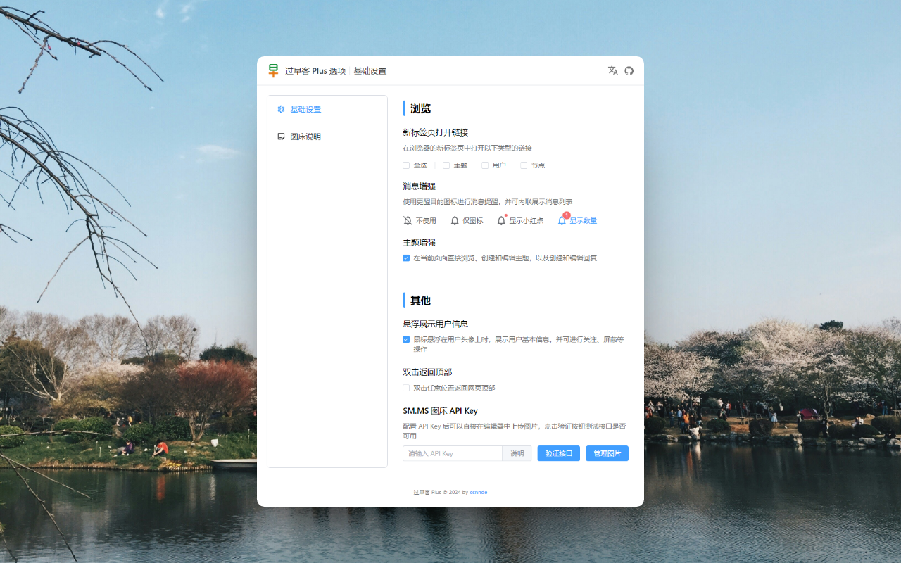
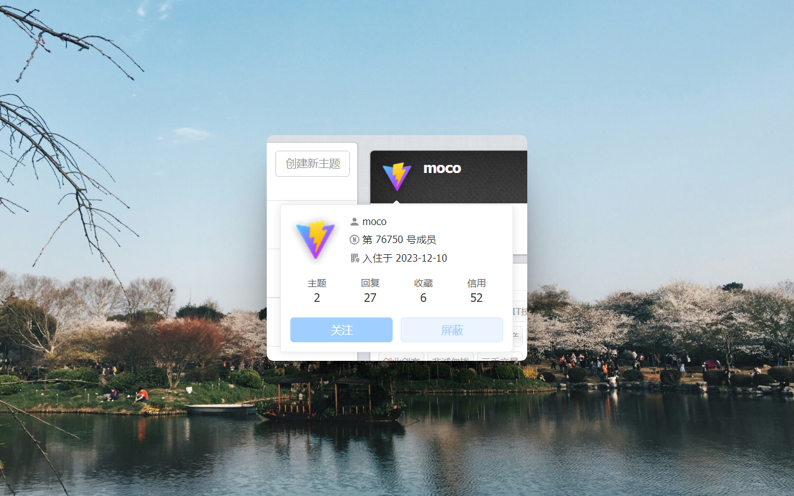
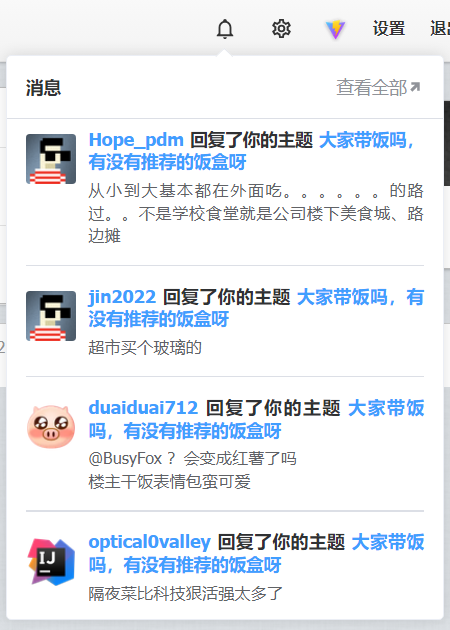
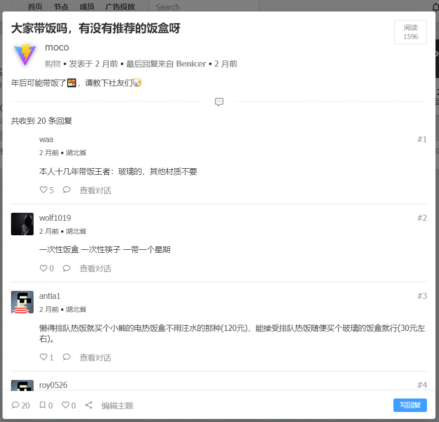
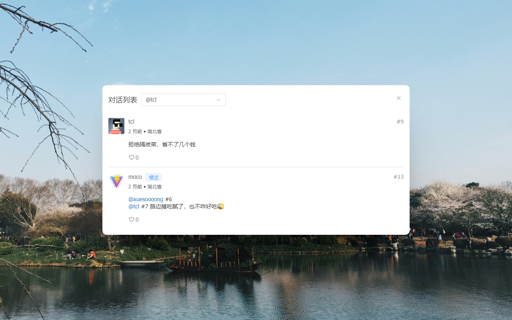
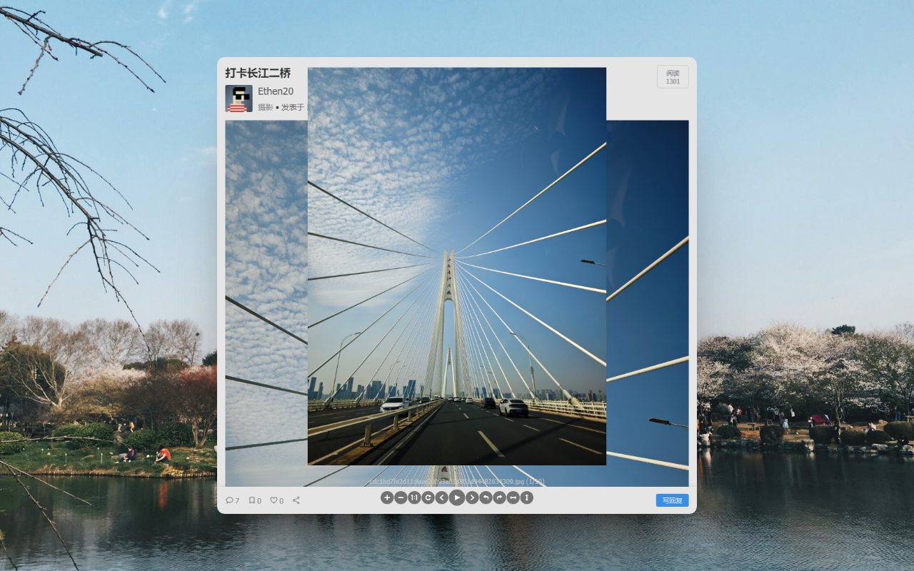
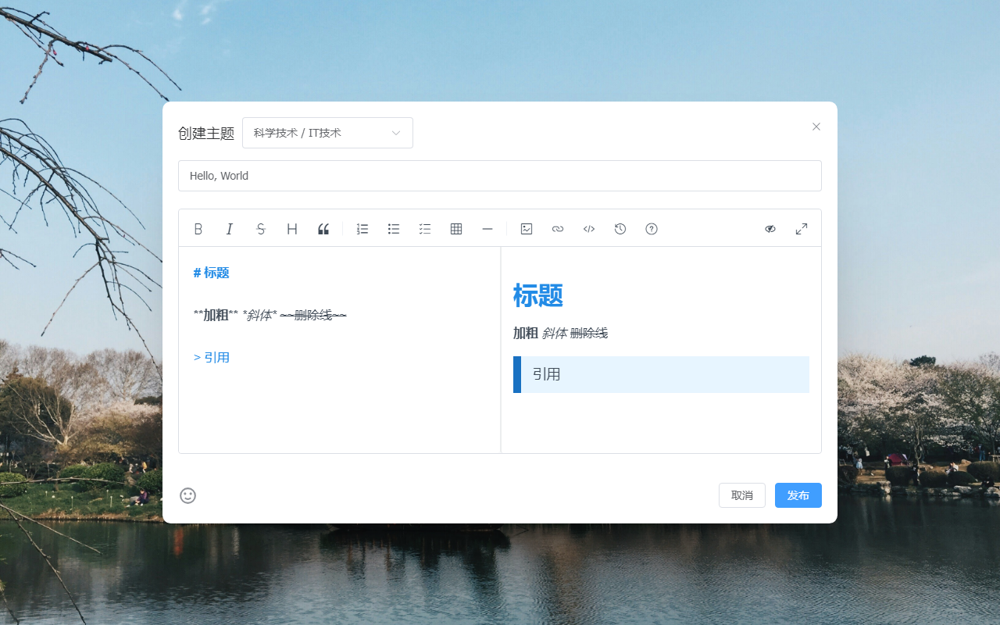
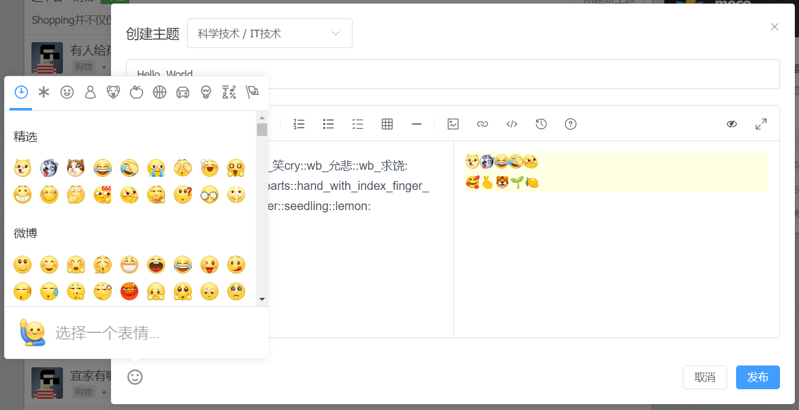
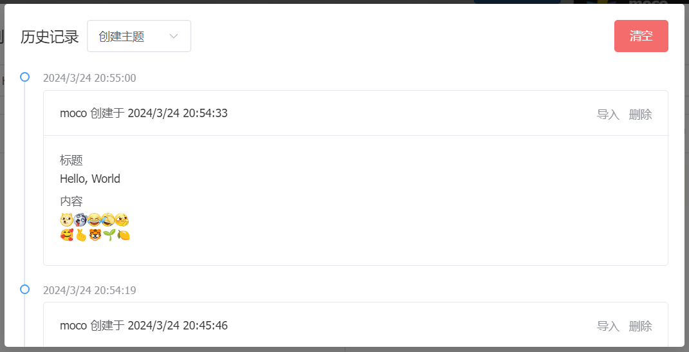

# 过早客 Plus [![github stars][github-stars]][github-repo]

[![chrome version][chrome-version]][chrome-link]
[![chrome users][chrome-users]][chrome-link]
[![chrome stars][chrome-stars]][chrome-link]

[![edge version][edge-version]][edge-link]
[![edge users][edge-users]][edge-link]
[![edge stars][edge-stars]][edge-link]

[![firefox version][firefox-version]][firefox-link]
[![firefox users][firefox-users]][firefox-link]
[![firefox stars][firefox-stars]][firefox-link]

[过早客论坛](https://www.guozaoke.com/) 增强插件，提供了丰富的扩展功能，全方位提升您的浏览体验～

如果本项目对您有所帮助，可以点个 star 🌟 支持，谢谢 🙏

## 技术栈

Vue3(Composition API) + Vue Router + Vue I18n + Pinia + Vite + Element Plus + TypeScript + Unocss + Scss

ESLint + Stylelint + Commitlint + Prettier + Lint Staged + Husky

## 安装

### 应用商店

请根据你的浏览器选择相应的安装地址

Chrome: <https://chromewebstore.google.com/detail/lbdkjckninkejnacdmbnakdfalglfmkd>

Edge: <https://microsoftedge.microsoft.com/addons/detail/eoindkoinilbnhiaajccmhjdlifeodfm>

Firefox: <https://addons.mozilla.org/zh-CN/firefox/addon/gzker-plus>

### 离线安装

适用于 Chromium 内核浏览器，比如 Chrome/Edge/QQ 浏览器等

- <https://github.com/ccnnde/gzker-plus/releases> 下载 `gzker-plus-x.x.x-chromium.zip`，并解压
- 在浏览器的扩展管理页面打开 **开发者模式**
- 点击 **加载已解压的扩展程序**，选中你解压好的目录即可

## 功能

- 💬 用户信息悬浮窗：鼠标悬浮在用户头像上时，展示用户基本信息，并可进行关注、屏蔽等操作
- 📬 消息增强：使用更醒目的图标进行消息提醒，并可内联展示消息列表
- 📋 主题增强
  - 在当前页面直接浏览、创建、编辑和屏蔽主题，以及创建和编辑回复
  - 提供更美观的浏览界面，更便捷的操作方式（点赞，收藏等）
  - 添加直接发布主题的按钮
  - 创建主题时，可快速选择任意主题节点
  - 回复其他用户时带上楼层号
  - 可查看主题回复中用户之间的对话
  - 滚动到底部时自动加载下一页回复
  - 点击图片后可以进行放大、缩小等操作，还可快速浏览其他图片
  - 完善用户屏蔽，解决论坛屏蔽用户后，仍有可能看到对方主题的问题
  - 支持关键字屏蔽主题，可通过右键菜单或快捷键快速添加
- 📝 编辑器增强
  - 支持 Markdown 语法，实时预览内容，所见即所得
    - 提供 Markdown 语法的帮助文档
    - 预览时自动将图片链接渲染为图片，链接文本和 `@uid` 渲染为可点击的链接
  - 提供丰富的操作按钮和快捷键，诸如加粗、斜体、预览、全屏、提交等
  - 可通过拖拽、复制粘贴、选择文件等方式上传图片
  - 支持 S\.EE（原 SMMS）、BiliBili 图床，所以需要访问 `s.ee`、`www.bilibili.com` 的权限
  - 自动保存所编辑的内容，并生成历史记录（本地存储），且可导入到编辑器中
  - 支持插入微博表情和更丰富的 emoji 表情
  - 支持 @ 其他用户，并可快捷清除 `@uid`
- 🎨 支持深色模式切换，并添加多种深色和浅色主题样式
- 🖱️ 右键菜单快捷操作：支持屏蔽关键字、打开扩展设置、Base64 解码等
- 🔗 新标签页打开主题、用户、节点等链接
- 🚀 双击任意位置返回网页顶部

## 更新日志

[ChangeLog](src/markdown/ChangeLog.md)

## 截图

### 扩展设置

### 用户信息悬浮窗

### 消息列表

### 浏览主题

### 查看对话

### 浏览图片

### 编辑内容

### 上传图片

### 插入表情

### 历史记录

## License

[AGPLv3](LICENSE) © Nor Cod

<!-- badge -->

[github-stars]: https://img.shields.io/github/stars/ccnnde/gzker-plus?label=Star%20Project
[chrome-version]: https://img.shields.io/chrome-web-store/v/lbdkjckninkejnacdmbnakdfalglfmkd?style=for-the-badge&logo=googlechrome&logoColor=white&color=d8a217
[chrome-users]: https://img.shields.io/chrome-web-store/users/lbdkjckninkejnacdmbnakdfalglfmkd?style=for-the-badge&color=deepgreen
[chrome-stars]: https://img.shields.io/chrome-web-store/stars/lbdkjckninkejnacdmbnakdfalglfmkd?style=for-the-badge
[edge-version]: https://img.shields.io/badge/dynamic/json?style=for-the-badge&logo=singlestore&logoColor=white&label=EDGE%20WEB%20STORE&color=32a88a&prefix=v&query=$.version&url=https://microsoftedge.microsoft.com/addons/getproductdetailsbycrxid/eoindkoinilbnhiaajccmhjdlifeodfm
[edge-users]: https://img.shields.io/badge/dynamic/json?style=for-the-badge&label=USERS&color=deepgreen&query=$.activeInstallCount&url=https://microsoftedge.microsoft.com/addons/getproductdetailsbycrxid/eoindkoinilbnhiaajccmhjdlifeodfm
[edge-stars]: https://img.shields.io/badge/dynamic/json?style=for-the-badge&label=RATING&color=deepgreen&suffix=/5&query=$.averageRating&url=https://microsoftedge.microsoft.com/addons/getproductdetailsbycrxid/eoindkoinilbnhiaajccmhjdlifeodfm
[firefox-version]: https://img.shields.io/amo/v/gzker-plus?style=for-the-badge&logo=firefoxbrowser&logoColor=white&color=orange
[firefox-users]: https://img.shields.io/amo/users/gzker-plus?style=for-the-badge&color=deepgreen
[firefox-stars]: https://img.shields.io/amo/rating/gzker-plus?style=for-the-badge&color=deepgreen

<!-- link -->

[github-repo]: https://github.com/ccnnde/gzker-plus
[chrome-link]: https://chromewebstore.google.com/detail/lbdkjckninkejnacdmbnakdfalglfmkd
[edge-link]: https://microsoftedge.microsoft.com/addons/detail/eoindkoinilbnhiaajccmhjdlifeodfm
[firefox-link]: https://addons.mozilla.org/zh-CN/firefox/addon/gzker-plus
