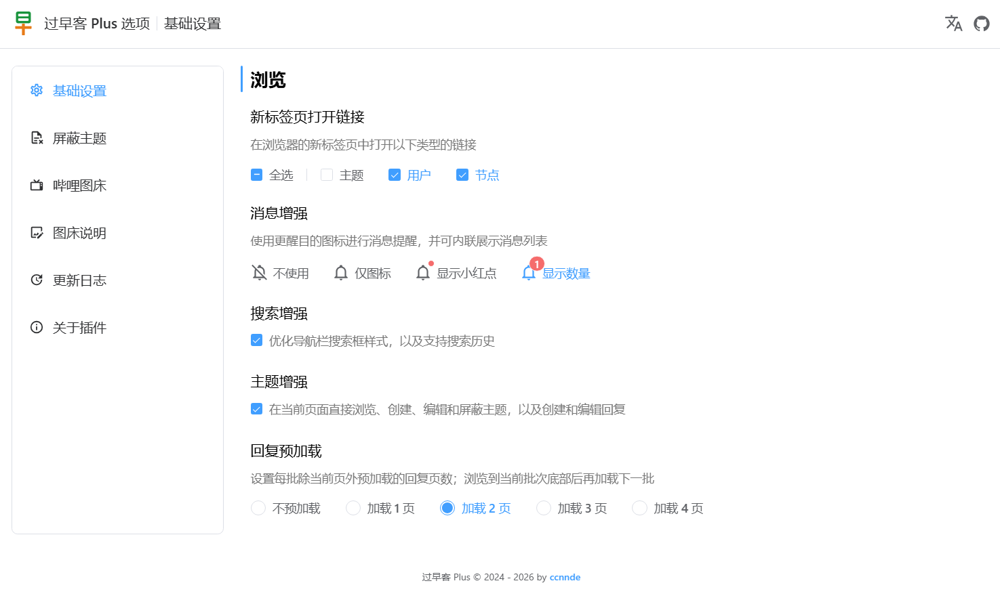
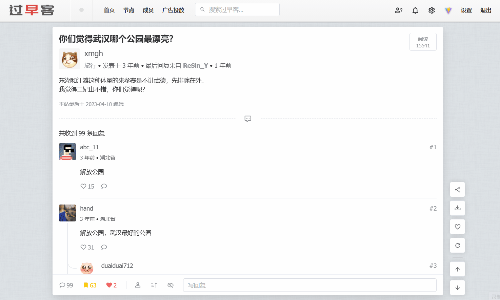
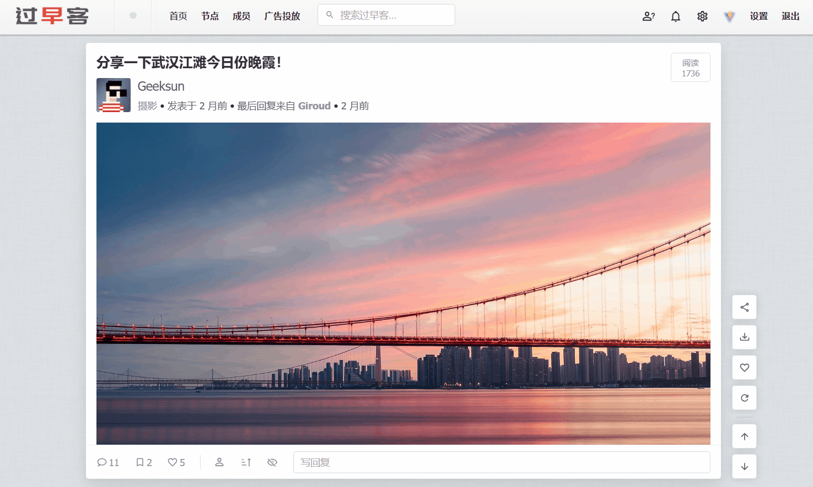
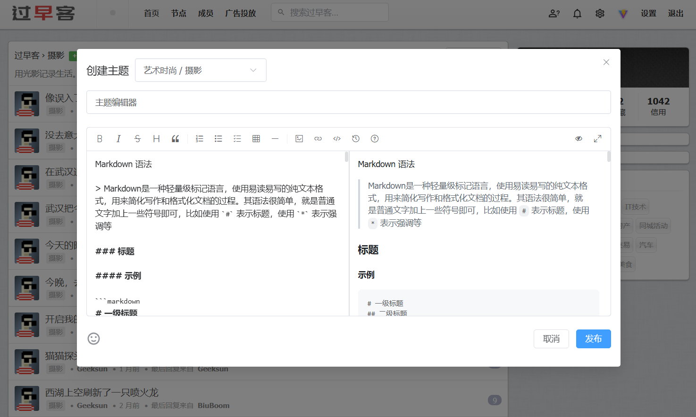
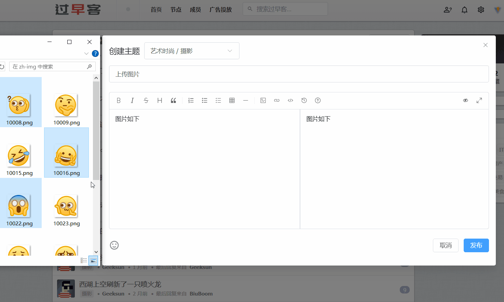
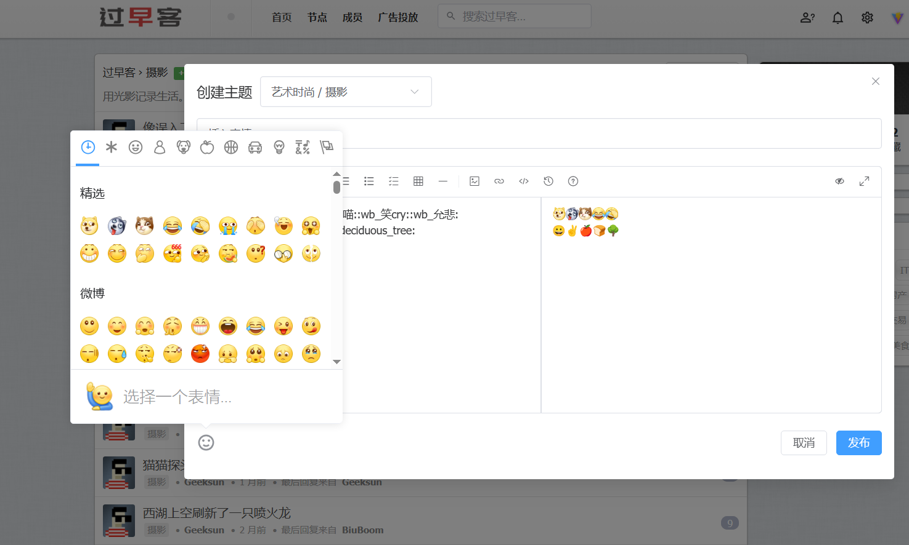
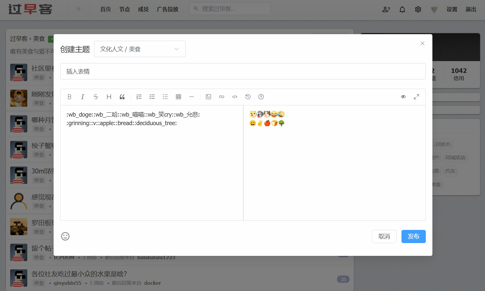
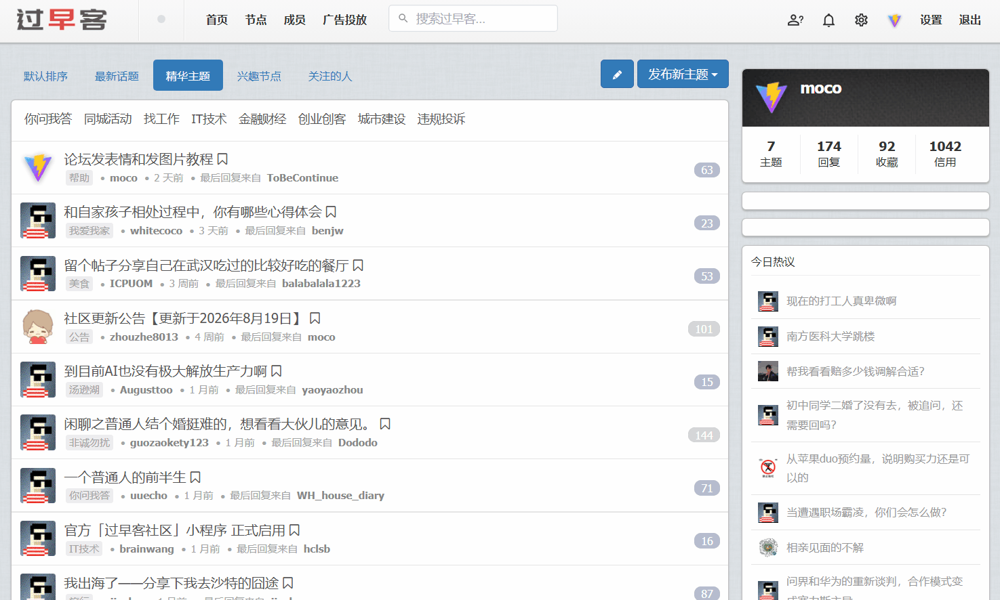

# 过早客 Plus [![github stars][github-stars]][github-repo]

[![chrome version][chrome-version]][chrome-link]
[![chrome users][chrome-users]][chrome-link]
[![chrome rating][chrome-rating]][chrome-link]

[![edge version][edge-version]][edge-link]
[![edge users][edge-users]][edge-link]
[![edge stars][edge-stars]][edge-link]

[![firefox version][firefox-version]][firefox-link]
[![firefox users][firefox-users]][firefox-link]
[![firefox stars][firefox-stars]][firefox-link]

[过早客论坛](https://www.guozaoke.com/) 增强插件，提供了丰富的扩展功能，全方位提升您的浏览体验～

如果本项目对您有所帮助，可以点个 star 🌟 支持，谢谢 🙏

## 技术栈

Vue3(Composition API) + Vue Router + Vue I18n + Pinia + WXT + Vite + Element Plus + TypeScript + Unocss + Scss

ESLint + Stylelint + Commitlint + Prettier + Lint Staged + Husky

## 安装

### 应用商店

请根据你的浏览器选择相应的安装地址

Chrome: <https://chromewebstore.google.com/detail/lbdkjckninkejnacdmbnakdfalglfmkd>

Edge: <https://microsoftedge.microsoft.com/addons/detail/eoindkoinilbnhiaajccmhjdlifeodfm>

Firefox: <https://addons.mozilla.org/zh-CN/firefox/addon/gzker-plus>

### 离线安装

适用于 Chromium 内核浏览器，比如 Chrome/Edge/QQ 浏览器等

- <https://github.com/ccnnde/gzker-plus/releases> 下载 `gzker-plus-x.x.x-chrome.zip`，并解压
- 在浏览器的扩展管理页面打开 **开发者模式**
- 点击 **加载已解压的扩展程序**，选中你解压好的目录即可

## 功能

#### 💬 主题浏览增强

- **主题操作**：可直接在当前页面浏览、创建、编辑和屏蔽主题，以及创建和编辑回复
- **嵌套回复**：更直观地查看楼中楼回复关系，支持逐层缩进、左侧对齐和平铺模式
- **浏览模式**：支持倒序浏览、只看楼主和查看热门回复
- **悬浮对话**：悬浮回复中的用户提及，即可查看该用户此前的回复
- **回复加载**：支持回复预加载，滚动到底部后自动加载下一页，减少等待和手动翻页
- **图片浏览**：支持图片放大、缩小、下载以及连续浏览

#### 📝 Markdown 编辑器增强

- **实时预览**：编写内容时即可查看最终效果
- **编辑工具**：支持加粗、斜体、预览、全屏、提交等常用操作与快捷键
- **图片上传**：支持拖拽、复制粘贴、选择文件等方式上传图片
- **自动保存**：自动保存编辑内容并生成本地历史记录，可随时重新导入
- **表情支持**：支持微博表情和更多 Emoji 表情

#### 🛡️ 内容过滤增强

- **用户屏蔽**：完善论坛原有屏蔽能力，减少被屏蔽用户的主题再次出现
- **关键字屏蔽**：可根据关键字自动过滤不感兴趣的主题
- **快捷屏蔽**：支持通过右键菜单或快捷键快速添加屏蔽关键字

#### 🎨 界面与使用体验

- **深色模式**：支持快速切换深色显示
- **主题样式**：提供多种深色和浅色主题，可按自己的习惯定制论坛界面
- **用户浮窗**：悬浮用户头像即可查看基本信息，并进行关注、屏蔽等操作
- **消息列表**：无需离开当前页面即可快速查看消息列表

<strong>更多功能</strong>

 

- **快速发布**：提供直接发布主题的入口
- **节点选择**：创建主题时可快速选择任意主题节点
- **楼层标记**：回复其他用户时自动带上楼层号
- **主题刷新**：支持快速刷新当前主题内容
- **主题导出**：一键将完整主题导出为 Markdown 文件
- **图床支持**：支持 S.EE（原 SMMS）和 BiliBili 图床
- **用户提及**：支持 `@用户`，并可快捷清除 `@uid`
- **语法帮助**：提供 Markdown 语法帮助文档
- **消息提醒**：使用更醒目的图标提示新消息
- **搜索增强**：支持搜索历史、键盘选择，并可通过必应搜索论坛内容
- **配置管理**：支持导入、导出配置，并可恢复基本设置默认值
- **右键菜单**：支持关键字屏蔽、打开扩展设置、Base64 解码等操作
- **新标签页**：主题、用户、节点等链接支持在新标签页打开
- **返回顶部**：双击页面任意位置即可返回顶部

## 更新日志

[ChangeLog](src/markdown/ChangeLog.md)

## 截图

<table>
  <tr>
    <td>扩展设置</td>
    <td>浏览主题</td>
  </tr>
  <tr>
    <td></td>
    <td></td>
  </tr>
  <tr>
    <td>浏览图片</td>
    <td>编辑内容</td>
  </tr>
  <tr>
    <td></td>
    <td></td>
  </tr>
  <tr>
    <td>上传图片</td>
    <td>插入表情</td>
  </tr>
  <tr>
    <td></td>
    <td></td>
  </tr>
  <tr>
    <td>历史记录</td>
    <td>论坛主题</td>
  </tr>
  <tr>
    <td></td>
    <td></td>
  </tr>
</table>

## License

[AGPLv3](LICENSE) © Nor Cod

<!-- badge -->

[github-stars]: https://img.shields.io/github/stars/ccnnde/gzker-plus?label=Star%20Project
[chrome-version]: https://img.shields.io/chrome-web-store/v/lbdkjckninkejnacdmbnakdfalglfmkd?style=for-the-badge&logo=googlechrome&logoColor=white&color=d8a217
[chrome-users]: https://img.shields.io/chrome-web-store/users/lbdkjckninkejnacdmbnakdfalglfmkd?style=for-the-badge&color=deepgreen
[chrome-rating]: https://img.shields.io/chrome-web-store/rating/lbdkjckninkejnacdmbnakdfalglfmkd?style=for-the-badge
[edge-version]: https://img.shields.io/badge/dynamic/json?style=for-the-badge&logo=singlestore&logoColor=white&label=EDGE%20WEB%20STORE&color=32a88a&prefix=v&query=$.version&url=https://microsoftedge.microsoft.com/addons/getproductdetailsbycrxid/eoindkoinilbnhiaajccmhjdlifeodfm
[edge-users]: https://img.shields.io/badge/dynamic/json?style=for-the-badge&label=USERS&color=deepgreen&query=$.activeInstallCount&url=https://microsoftedge.microsoft.com/addons/getproductdetailsbycrxid/eoindkoinilbnhiaajccmhjdlifeodfm
[edge-stars]: https://img.shields.io/badge/dynamic/json?style=for-the-badge&label=RATING&color=deepgreen&suffix=/5&query=$.averageRating&url=https://microsoftedge.microsoft.com/addons/getproductdetailsbycrxid/eoindkoinilbnhiaajccmhjdlifeodfm
[firefox-version]: https://img.shields.io/amo/v/gzker-plus?style=for-the-badge&logo=firefoxbrowser&logoColor=white&color=orange
[firefox-users]: https://img.shields.io/amo/users/gzker-plus?style=for-the-badge&color=deepgreen
[firefox-stars]: https://img.shields.io/amo/rating/gzker-plus?style=for-the-badge&color=deepgreen

<!-- link -->

[github-repo]: https://github.com/ccnnde/gzker-plus
[chrome-link]: https://chromewebstore.google.com/detail/lbdkjckninkejnacdmbnakdfalglfmkd
[edge-link]: https://microsoftedge.microsoft.com/addons/detail/eoindkoinilbnhiaajccmhjdlifeodfm
[firefox-link]: https://addons.mozilla.org/zh-CN/firefox/addon/gzker-plus
