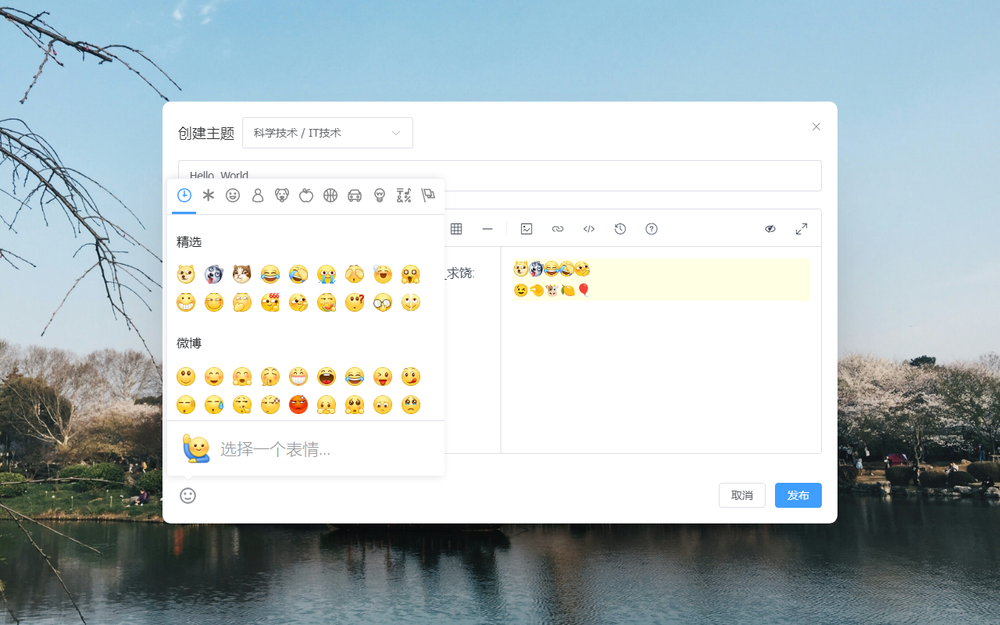
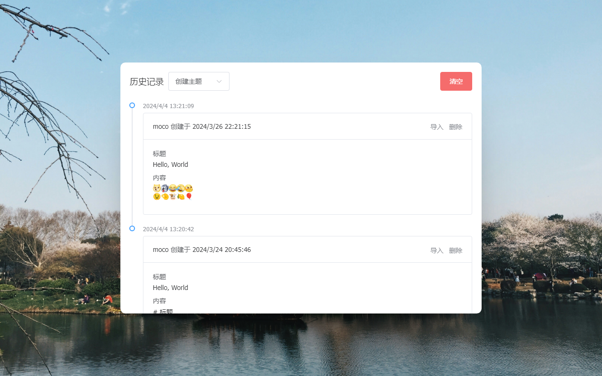

# 过早客 Plus

[过早客论坛](https://www.guozaoke.com/) 增强插件，提供了丰富的扩展功能，全方位提升您的浏览体验～

如果本项目对您有所帮助，可以点个 star 🌟 支持，谢谢 🙏

## 技术栈

Vue3(Composition API) + Vue Router + Vue I18n + Pinia + Vite + Element Plus + TypeScript + Unocss + Scss

ESLint + Stylelint + Commitlint + Prettier + Lint Staged + Husky

## 安装

### 应用商店

请根据你的浏览器选择相应的安装地址

Chrome: <https://chromewebstore.google.com/detail/lbdkjckninkejnacdmbnakdfalglfmkd>

Edge: <https://microsoftedge.microsoft.com/addons/detail/eoindkoinilbnhiaajccmhjdlifeodfm>

Firefox: <https://addons.mozilla.org/zh-CN/firefox/addon/gzker-plus>

### 离线安装

适用于 Chromium 内核浏览器，比如 Chrome/Edge/QQ 浏览器等

- <https://github.com/ccnnde/gzker-plus/releases> 下载 `gzker-plus-x.x.x-chromium.zip`，并解压
- 在浏览器的扩展管理页面打开 **开发者模式**
- 点击 **加载已解压的扩展程序**，选中你解压好的目录即可

## 功能

- 💬 用户信息悬浮窗：鼠标悬浮在用户头像上时，展示用户基本信息，并可进行关注、屏蔽等操作
- 📬 消息增强：使用更醒目的图标进行消息提醒，并可内联展示消息列表
- 📋 主题增强
  - 在当前页面直接浏览、创建、编辑和屏蔽主题，以及创建和编辑回复
  - 提供更美观的浏览界面，更便捷的操作方式（点赞，收藏等）
  - 创建主题时，可快速选择任意主题节点
  - 回复其他用户时带上楼层号
  - 可查看主题回复中用户之间的对话
  - 滚动到底部时自动加载下一页回复
  - 点击图片后可以进行放大、缩小等操作，还可快速浏览其他图片
- 📝 编辑器增强
  - 支持 Markdown 语法，实时预览内容，所见即所得
    - 提供 Markdown 语法的帮助文档
    - 预览时自动将图片链接渲染为图片，链接文本和 `@uid` 渲染为可点击的链接
  - 提供丰富的操作按钮和快捷键，诸如加粗、斜体、预览、全屏、提交等
  - 可通过拖拽、复制粘贴、选择文件等方式上传图片
  - 支持 SMMS、BiliBili 图床，所以需要访问 sm.ms、www.bilibili.com 的权限
  - 自动保存所编辑的内容，并生成历史记录（本地存储），且可导入到编辑器中
  - 支持插入微博表情和更丰富的 emoji 表情
  - 支持 @ 其他用户，并可快捷清除 `@uid`
- 🔗 新标签页打开主题、用户、节点等链接
- 🚀 双击任意位置返回网页顶部

## 更新日志

[ChangeLog](src/markdown/ChangeLog.md)

## 截图

### 扩展设置

### 用户信息悬浮窗

### 消息列表

### 浏览主题

### 查看对话

### 浏览图片

### 编辑内容

### 上传图片

### 插入表情

### 历史记录

## License

[AGPLv3](LICENSE) © Nor Cod
