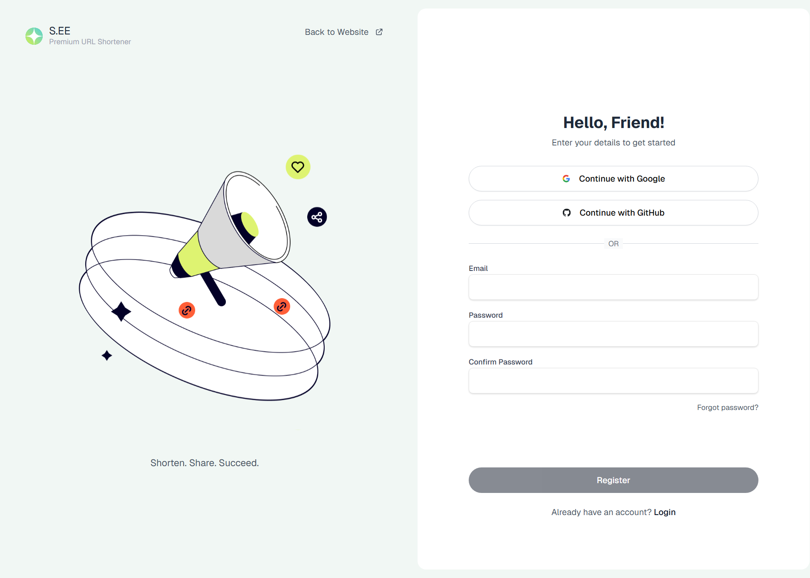
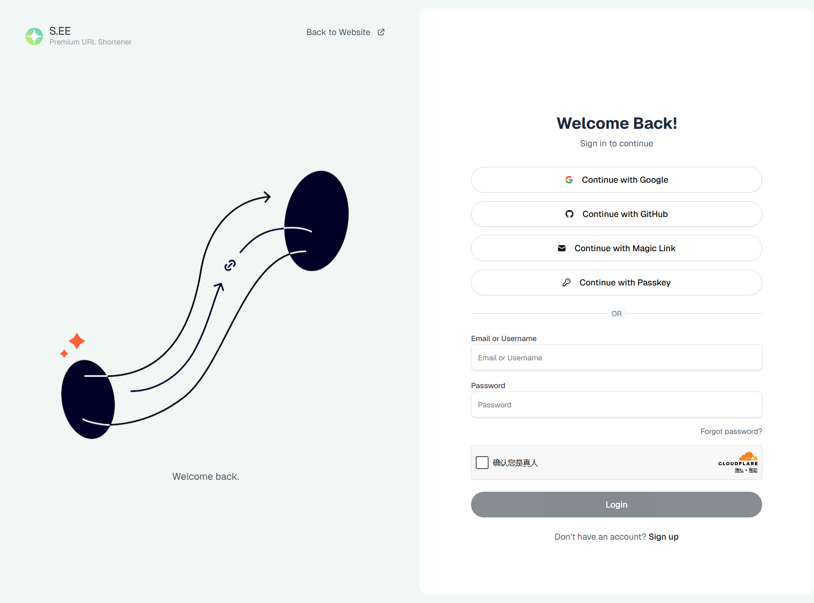
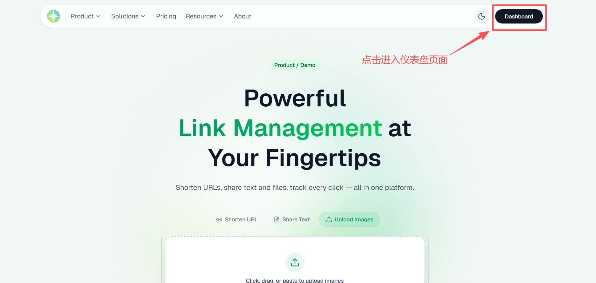
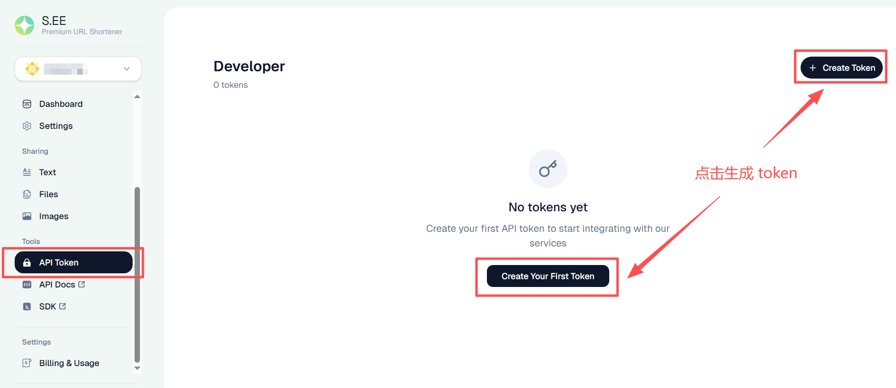
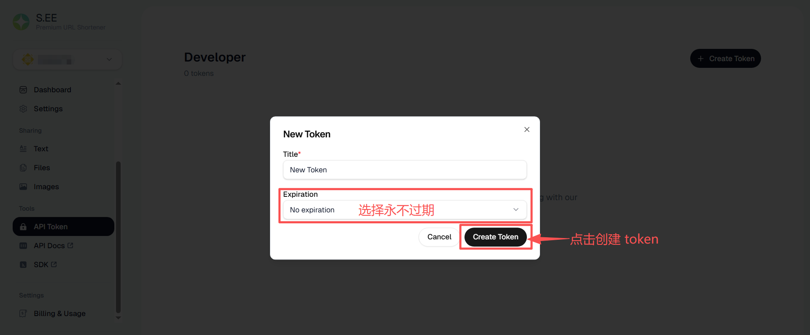
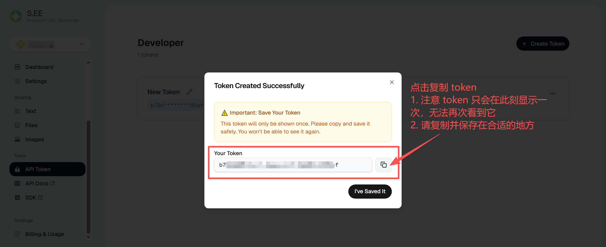
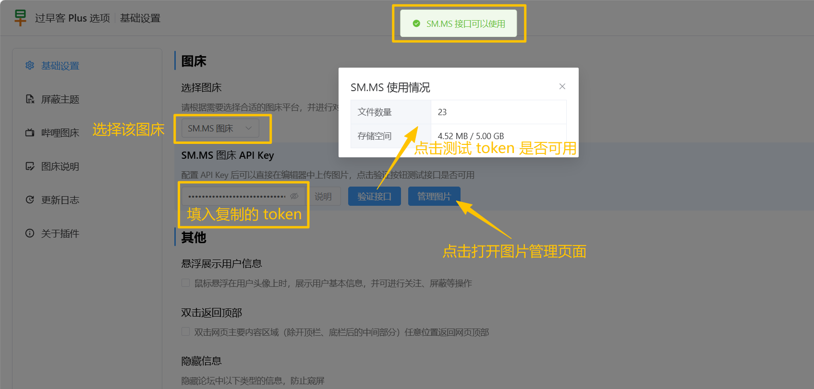
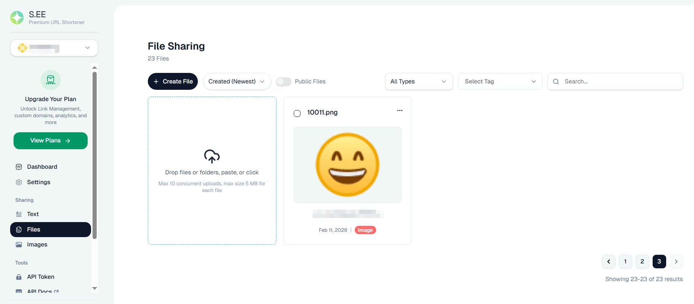
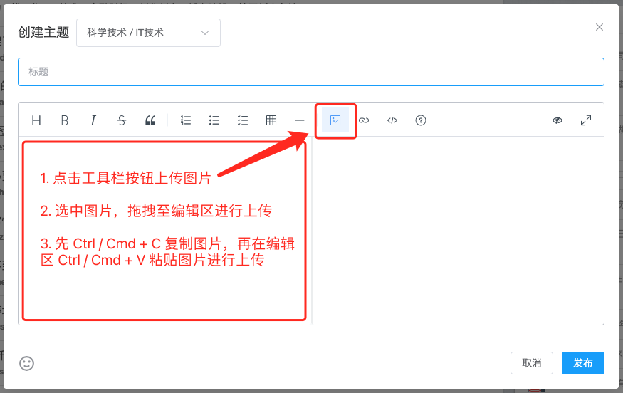
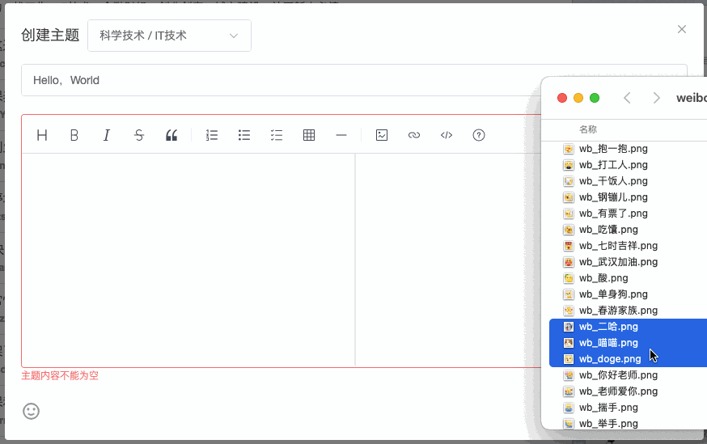

## BiliBili 图床配置

推荐使用该图床，只需登录 <https://www.bilibili.com> 即可（首次传图需要）

在【哔哩图床】页面中可以对已上传的图片进行搜索、删除等操作（仅影响本地的历史记录，不会删除已经上传到服务器的图片）

## SM\.MS 图床配置

如果你曾经配置过 SM\.MS 图床，**请注意 SM\.MS 已停止活跃更新，你的 SM\.MS 账户已经迁移至 S\.EE**，以下内容摘自官方说明

> S\.EE 由原 SM\.MS 开发团队开发和运营，此次迁移将为你提供更稳定、更现代、更丰富的服务体验
>
> **为什么迁移**
>
> - SM\.MS 已停止活跃更新
> - S\.EE 在基础设施和稳定性方面表现更好
> - S\.EE 提供更多功能，例如私密文件（密码访问）和更完善的 API
>
> **如何访问你的账户**
>
> 出于安全考虑，密码不会被迁移
>
> 请使用你在 SM\.MS 的邮箱前往以下页面重置密码：
>
> <https://s.ee/user/forgot-password>
>
> **关于旧图片**
>
> 你的旧图片链接仍可访问，但目前处于只读模式：
>
> - 可访问
> - 可删除
>
> 完整原文地址 <https://sm.ms/migration>

配置 API Key 后可以直接在编辑器中上传图片，具体步骤如下：

点击链接 <https://s.ee/user/register> 注册图床账号，如已有账号则跳过此步骤

点击链接 <https://s.ee/user/login> 登录图床

点击链接 <https://s.ee/user/developers> 进入 API Token 页面。或者先点击 **Dashboard** 按钮进入仪表盘 <https://s.ee/user/dashboard/>

首次访问时，API Token 是空的，需要点击 **Create Token** 按钮生成

Token 过期时间选择 **No expiration（永不过期）**

下图中的 Token 就是图床的 API Key，**复制** 其内容

打开扩展选项页的【基础设置】页面，在【图床】中选择 **SM\.MS 图床**，然后找到 **SM\.MS 图床 API Key** 选项

- 填入先前复制的 Token
- 点击 **验证接口** 按钮，如果弹出下图所示的信息，则配置成功
- 点击 **管理图片** 按钮，进入图片管理页面，可以进行图片的搜索、删除等操作

## 编辑器上传图片

支持以下方式进行图片上传（**批量上传最多 5 张图片，每张图片最大不能超过 5MB**，BiliBili 图床无此限制）

上传成功后会自动在编辑区里插入图片

