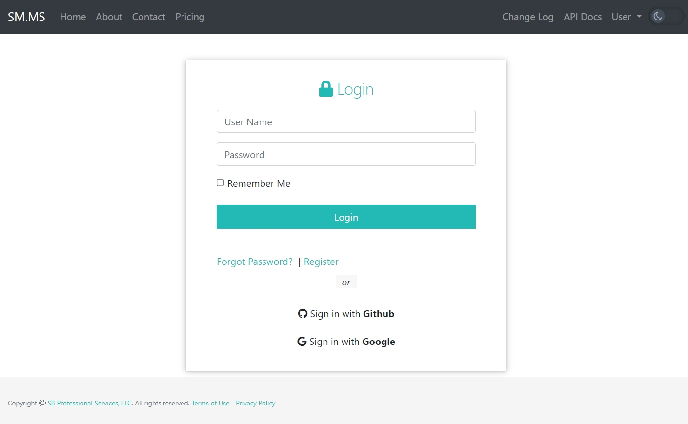
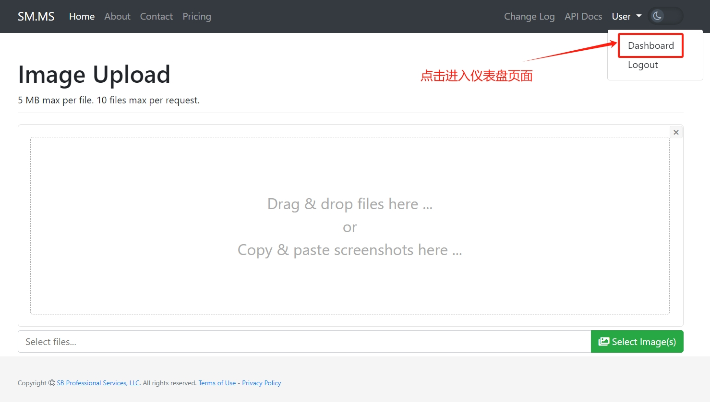
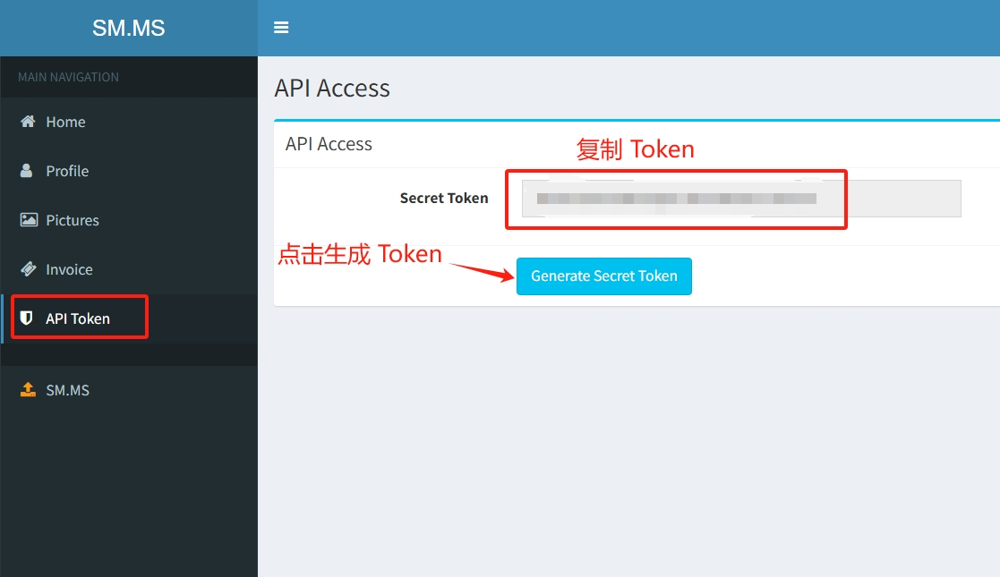
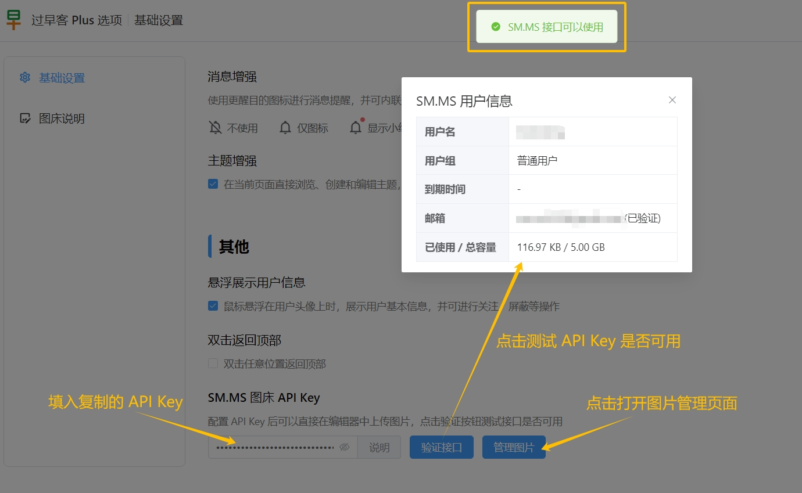
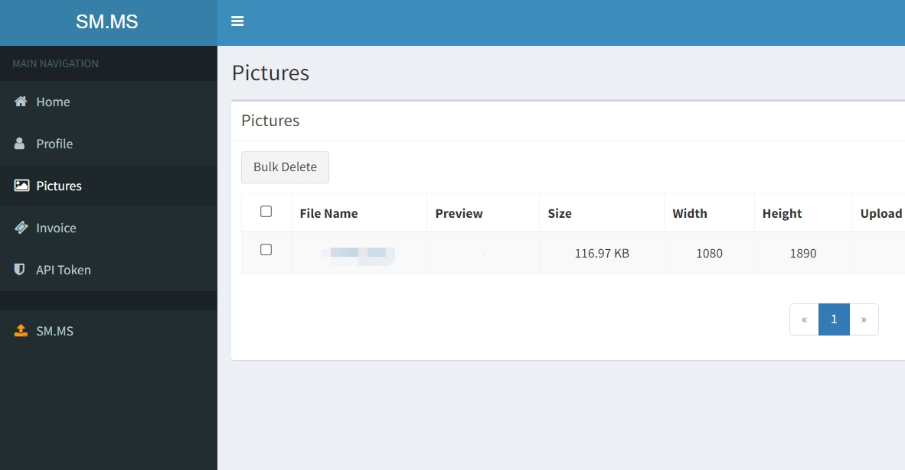

## SM\.MS 图床配置

配置 API Key 后可以直接在编辑器中上传图片，具体步骤如下：

点击链接 <https://smms.app/register> 注册图床账号，如已有账号则跳过此步骤

点击链接 <https://smms.app/login> 登录图床

点击链接 <https://smms.app/home/apitoken> 进入 API Token 页面。或者先点击 **Dashboard** 按钮进入仪表盘，再查看 API Token

下图中的 Secret Token 就是图床的 API Key，**复制** 其内容。首次访问时 API Key 可能是空的，需要点击 **Generate Secret Token** 按钮生成

打开扩展选项页的基础设置页面，找到 **SM\.MS 图床 API Key** 选项

- 填入先前复制的 API Key
- 点击 **验证接口** 按钮，如果弹出下图所示的用户信息，则配置成功
- 点击 **管理图片** 按钮，进入图片管理页面，可以进行图片的搜索、删除等操作

## 编辑器上传图片

支持以下方式进行图片上传（**批量上传最多 10 张图片，每张图片最大不能超过 5MB**）

上传成功后会自动在编辑区里插入图片

