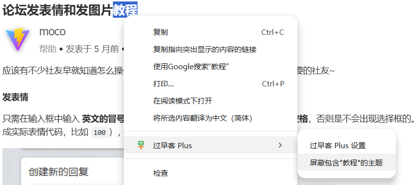

您可通过以下三种方式快速添加屏蔽的关键字

- **手动输入**：在设置中直接输入关键字进行屏蔽
- **右键菜单**：选中页面中的文本后，点击右键菜单中的 **屏蔽包含"xxx"的主题**（参考下图）
- **快捷键触发**：选中文本后，按下默认快捷键 **Alt+Shift+K**，即可一键屏蔽

您还可在浏览器中自定义扩展快捷键，**复制地址后在浏览器的地址栏中输入，然后按回车即可**

- **Chrome**: [chrome://extensions/shortcuts](chrome://extensions/shortcuts)
- **Edge**: [edge://extensions/shortcuts](edge://extensions/shortcuts)
- **Firefox**: [about:addons → 扩展 → 设置 → 管理扩展快捷键](about:addons)
